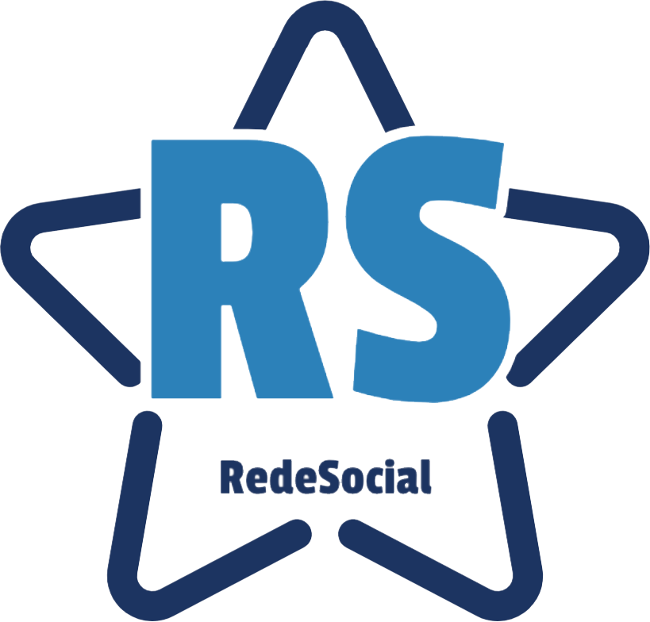

# Rede Social

    

## A aplicação

Nesta aplicação você pode encontrar algumas ações/projetos sociais. Onde muitas dependem de contribuições e voluntários para se manterem ativas e continuar contribuindo para a sociedade de alguma forma.

Em cada projeto você escontrará uma descrição e formas de entrar em contato, seja por Instagram, Facebook, Website..

O nome **"Rede-Social"** é mais por ser uma aplicação onde possui (ou deve possuir) diversos projetos/ações sociais cadastradas, com informações necessárias sobre elas.

## O projeto

Este projeto trata-se de um **progressive wep app (PWA)** utilizando no front-end o webpack, ReactJS, service worker, manifest.js. 

Back end neste outro repositório: https://github.com/talitaoliveira/rede-social-back

No primeiro acesso aos projetos a aplicação já realiza o cache dos dados e arquivos necessários para o funcionamento offline. Com a possibilidade de poder adicionar ele a sua tela inicial do android.

Em breve postarei como contribuir..

